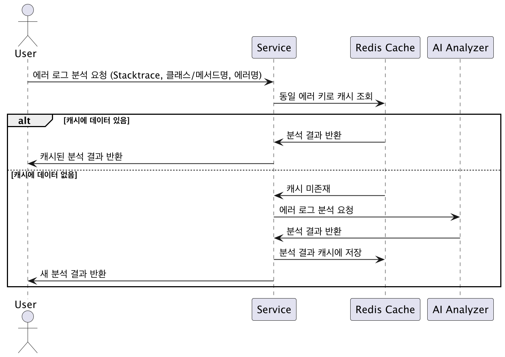

# ADR : [Cache]_[안성훈]

---

### **작성일**
2025-07-11

---

### **컨텍스트**

-   **문제 상황**: AI 기반 자동 분석 기능 사용 시, 동일한 에러 로그에 대한 분석 요청이 반복적으로 발생하고 있습니다. 이로 인해 AI 모델과의 통신 빈도가 높아져 불필요한 비용이 발생하고, 사용자에게 응답을 제공하는 데 시간이 지연되는 문제가 있습니다.

-   **요구사항**: AI와의 통신 비용을 절감하고, 동일한 에러에 대한 분석 요청 시 더 빠른 응답을 제공하기 위해 캐싱 시스템 도입이 필요합니다.

-   **제약 조건**:
    -   **기술적 제약**: 캐싱 솔루션은 기존 시스템 아키텍처에 최소한의 변경으로 통합될 수 있어야 합니다.
    -   **비즈니스적 제약**: AI 모델 사용 비용을 실질적으로 절감할 수 있어야 합니다.

-   **기술 비교 분석**:
    -   **Redis**: In-memory 데이터 구조 저장소로, 빠른 읽기/쓰기 속도를 제공하며 다양한 데이터 구조를 지원하여 복잡한 캐시 키 관리에 용이합니다.
    -   **Memcached**: In-memory 키-값 저장소로, 단순한 구조와 빠른 속도가 장점이지만, 데이터 타입이 단순하고 영속성을 지원하지 않습니다.
    -   **로컬 캐시 (Ehcache 등)**: 애플리케이션 내부에 캐시를 저장하여 매우 빠른 속도를 제공하지만, 많은 메모리가 필요하며, 분산 환경에서 데이터 동기화 문제가 발생할 수 있습니다.

---

### **결정**

-   **Redis**를 활용한 AI 자동 분석 내용 캐싱 시스템을 도입합니다.

-   **결정 핵심 내용**:
    -   **동일 에러 식별**: Stacktrace의 일부, 에러 발생 클래스/메서드명, 에러명을 조합하여 고유한 캐시 키를 생성합니다.
    -   **캐시 저장 및 조회**:
        -   새로운 에러 분석 요청 시, 생성된 캐시 키로 Redis를 조회합니다.
        -   캐시된 데이터가 없는 경우, AI 모델에 분석을 요청하고 결과를 Redis에 저장합니다.
        -   캐시된 데이터가 있는 경우, Redis에서 직접 데이터를 반환합니다.
    -   **캐시 유지 기간(TTL)**: 캐시 데이터의 TTL(Time-To-Live)은 **30일**로 설정합니다. 이를 통해 장기간 동일한 에러 분석 결과를 재사용하여 비용 절감 효과를 극대화하고, 주기적인 데이터 갱신을 보장합니다.

-   **시퀀스 다이어그램**:

     

---

### **결과**

-   **긍정적 결과**:
    -   **비용 절감**: 동일한 에러 분석 요청에 대한 AI 모델 호출을 최소화하여 API 사용 비용을 크게 절감할 수 있습니다. (예상 절감 효과: 약 30% 이상)
    -   **성능 향상**: 캐시된 데이터를 즉시 반환하여 평균 응답 시간을 단축시킵니다. (예상 응답 시간: 50ms 이내)
    -   **시스템 부하 감소**: AI 분석 모듈의 부하를 줄여 시스템 전반의 안정성을 높입니다.

-   **부정적 결과 및 트레이드오프**:
    -   **인프라 비용 증가**: Redis 서버 운영 및 유지보수 비용이 추가로 발생합니다.
    -   **데이터 일관성 문제**: AI 모델이 업데이트되어 분석 결과가 변경될 경우, 캐시된 데이터와 불일치가 발생할 수 있습니다. 이를 해결하기 위해 설정된 캐시 만료(TTL) 정책에 따라 데이터가 주기적으로 갱신됩니다.

---

### **대안**

-   **로컬 캐시 사용**:
    -   **장점**: 별도의 인프라 구축 없이 구현이 간단하고 매우 빠릅니다.
    -   **단점**: AI 분석 데이터는 양이 많고 캐시 유지 기간을 길게 가져갈 예정이라, 로컬 캐시에 모두 적재 시 애플리케이션 서버의 **메모리 부하가 발생**할 수 있습니다. 또한 서버 재시작 시 캐시 데이터가 유실됩니다.
    -   **선택하지 않은 이유**: AI 분석 데이터의 양과 긴 캐시 유지 기간을 고려했을 때, 로컬 캐시는 서버의 **메모리 부하**를 가중시킬 수 있습니다. 안정적인 캐시 데이터 보존이 필요하고 메모리 관리를 위해 외부 캐시 솔루션이 더 적합하다고 판단했습니다.

-   **데이터베이스 캐싱**:
    -   **장점**: 데이터 영속성이 보장되고, 기존 데이터베이스 시스템을 활용할 수 있습니다.
    -   **단점**: 디스크 I/O로 인해 Redis와 같은 In-memory 캐시보다 속도가 느립니다.
    -   **선택하지 않은 이유**: 빠른 응답 속도라는 핵심 요구사항을 충족시키기에는 성능이 부족하다고 판단했습니다.

---

### **담당자**

-   **작성자**: 안성훈
-   **검토자**: 최현호