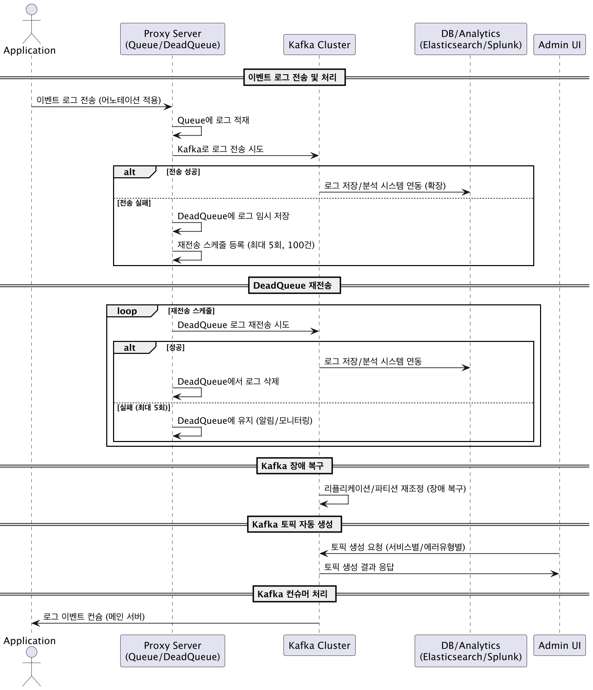

## ADR: [Kafka] Kafka 프록시를 이용한 이벤트 스트리밍 시스템 도입

### **작성일**
2025-07-15

### **컨텍스트**

-   **문제 상황**: 다양한 서비스에서 발생하는 대규모 이벤트 로그를 안정적으로 수집하고, 분석할 수 있는 시스템 아키텍처가 필요합니다. 
각 서비스에 Kafka Producer 설정을 직접 포함할 경우, 서비스 간 설정 종속성이 생기고 Kafka 클러스터 변경 시 모든 서비스의 수정이 필요한 문제가 있습니다.
-   **핵심 요구사항**:
    -   **고성능 처리**: 초당 10,000건 이상의 이벤트를 안정적으로 처리
    -   **무손실 데이터**: 이벤트 로그 손실률 0%를 목표로 데이터 복제 및 장애 복구 메커니즘 적용
    -   **확장성**: 트래픽 증가에 유연하게 대응할 수 있는 수평적 확장 구조
    -   **유연한 토픽 관리**: 서비스별, 에러 유형별 토픽 구분 및 동적 생성 기능
    -   **느슨한 결합**: 개별 서비스와 메시징 시스템 간의 의존성을 최소화하여 유지보수 용이성 확보

---

### **결정**

1.  **Apache Kafka**를 중앙 이벤트 스트리밍 플랫폼으로 채택합니다.
2.  모든 서비스의 이벤트 발행을 중개하는 **Kafka 프록시 서버(Kafka Proxy Server)**를 도입합니다.

-   **결정 핵심 내용**:
    -   **아키텍처**:
        -   `각 서비스` → `Kafka 프록시 서버 (REST API)` → `Kafka 클러스터` → `Consumer (메인 서버, 분석 시스템)`
    -   **Kafka 프록시 서버**:
        -   **구현 기술**: 대량의 비동기 요청 처리에 이점이 있는 Spring WebFlux도 고려되었으나, 팀의 기술 숙련도 및 학습 곡선을 고려하여 보다 범용적인 **Spring MVC**로 구현합니다.
        -   각 서비스는 Kafka에 대한 직접적인 의존성 없이, 간단한 어노테이션이나 API 호출을 통해 프록시 서버로 로그 데이터를 전송합니다.
        -   프록시 서버는 내부에 **Queue를 구현**하여 대량의 요청을 버퍼링하고 순차적으로 Kafka에 전송합니다.
        -   Kafka로 전송 실패 시, 요청을 **Dead Letter Queue(DLQ)에 임시 저장**하고, 스케줄러를 통해 **재전송 로직(예: 5회)을 수행**하여 데이터 유실을 방지합니다.
    -   **Kafka 클러스터**:
        -   데이터 손실을 방지하기 위해 **리플리케이션(Replication)**을 활성화하여 구성합니다. 
        -   토픽은 서비스, 에러 유형 등을 조합하여 생성 및 관리하며, 어드민 페이지를 통해 **토픽 자동 생성 기능**을 제공합니다. 
    -   **Consumer**:
        -   메인 서버는 필요한 토픽을 구독(Consume)하여 비즈니스 로직을 처리합니다.
        -   향후 Elasticsearch, Splunk 등 외부 시스템으로의 확장을 고려하여 설계합니다. 

-   **시퀀스 다이어그램**:

---

### **결과**

-   **긍정적 결과**:
    -   **관심사 분리 및 유지보수 용이성**: 서비스는 비즈니스 로직에만 집중하고, Kafka와의 통신, 장애 처리, 재시도 등 복잡한 로직은 프록시 서버가 전담하여 시스템 구조가 단순해지고 유지보수가 용이해집니다.
    -   **안정성 및 신뢰성 향상**: 프록시 서버의 큐와 DLQ, 재시도 메커니즘을 통해 Kafka 클러스터의 일시적인 장애 상황에서도 데이터 손실을 0%에 가깝게 방지할 수 있습니다.
    -   **중앙 집중식 관리**: 이벤트 발행 로직이 프록시 서버에 중앙화되어 있어 성능 튜닝, 모니터링, 정책 변경이 용이합니다.
    -   **독립적인 확장**: 트래픽 증가 시 서비스, 프록시 서버, Kafka 브로커를 각각 독립적으로 수평 확장하여 유연하게 대응할 수 있습니다.

-   **부정적 결과 및 트레이드오프**:
    -   **아키텍처 복잡도 증가**: 프록시 서버라는 별도의 컴포넌트를 개발하고 운영해야 하는 비용이 발생합니다.
    -   **SPOF(Single Point of Failure) 가능성**: 프록시 서버 자체에 장애가 발생하면 전체 이벤트 수집이 중단될 수 있습니다. 이를 방지하기 위해 프록시 서버의 **고가용성(HA) 구성(예: 로드밸런서와 함께 다중화)**이 필수적입니다.
    -   **네트워크 지연 시간 증가**: 서비스가 Kafka로 직접 이벤트를 보내는 것보다 프록시 서버를 거치면서 1-hop의 네트워크 지연이 추가됩니다. 하지만 이는 일반적인 로그 수집 환경에서 무시할 수 있는 수준입니다.

---

### **대안**

-   **각 서비스에 Kafka Producer 직접 구현**:
    -   **장점**: 아키텍처가 단순하고, 프록시 서버 개발/운영 비용이 없습니다.
    -   **단점**: 서비스와 Kafka 간의 결합도가 높아져 Kafka 설정 변경 시 모든 서비스의 코드를 수정하고 재배포해야 합니다. 또한, 장애 처리 로직을 각 서비스에 중복으로 구현해야 합니다.
    -   **선택하지 않은 이유**: 유지보수 비용과 서비스 간 종속성 문제가 장기적으로 더 큰 비용을 유발할 것으로 판단했습니다.
-   **Logstash/Fluentd 등 외부 로그 수집기 사용**:
    -   **장점**: 검증된 오픈소스를 활용하여 빠르게 구축할 수 있습니다.
    -   **단점**: 커스텀 어노테이션 기반의 경량화된 연동 및 세밀한 재처리 정책(DLQ) 등 요구사항을 모두 충족시키기 위한 커스터마이징이 복잡할 수 있습니다.
    -   **선택하지 않은 이유**: 요구사항에 명시된 내부 서비스와의 유연한 연동 및 제어를 위해 직접 프록시를 구현하는 것이 더 효과적이라고 판단했습니다.

---

### **담당자**

-   **작성자**: 안성훈
-   **검토자**: 최현호