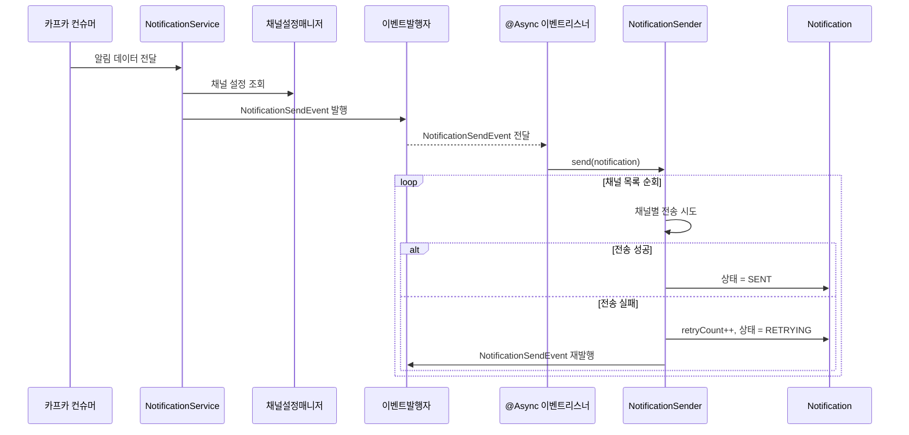
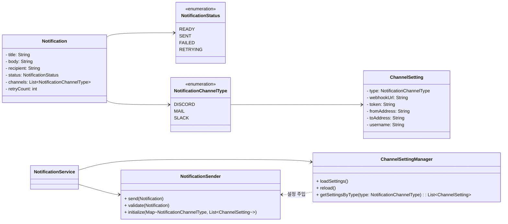

# ADR : Notification\_박희재

## 작성일

2025-07-20

---

## 컨텍스트

* 시스템 전반에서 장애, 상태 변화 등의 이벤트가 발생했을 때, 운영자 또는 사용자에게 다양한 채널을 통해 **알림을 전송**할 수 있어야 한다.
* 채널은 메일, 디스코드, 슬랙 등으로 구성되며, 향후 추가될 수 있다.
* 비동기적으로 알림을 전송하고, 실패 시 **자동 재시도**할 수 있는 구조가 요구된다.
* 알림 대상 채널은 **관리자 페이지를 통해 JSON으로 구성되어 서버에 저장**된다.
* 이 구조는 높은 유연성과 확장성을 요구하며, 구현 복잡도 및 유지보수성도 고려 대상이다.

---

## 결정

* 우리는 Notification 도메인을 중심으로, 이벤트 기반 알림 전송 구조를 채택한다.
* `NotificationService`가 알림을 발행하면, 이벤트 리스너가 해당 알림을 처리하고, 전송 실패 시 상태값과 재시도 횟수를 갱신한 뒤, 동일 이벤트를 다시 발행하여 재시도한다.
* 채널 설정은 JSON 파일로 저장되고, 서버 기동 시 `ChannelSettingManager`에서 인메모리로 로딩된다.
* 관리자 페이지에서 JSON 파일을 수정할 경우, 저장 후 `ChannelSettingManager.reload()`를 호출하여 설정을 재적용함으로써 **hot reload 효과**를 구현한다.
* `NotificationSender`는 채널별 전송을 처리하는 단일 인터페이스이며, 내부적으로 여러 설정을 순회하며 전송을 시도한다.

> 아래 시퀀스 다이어그램과 도메인 클래스 다이어그램은 구조를 시각적으로 보여준다.

### 시퀀스 다이어그램

### 도메인 클래스 다이어그램

---

## 결과

* 비동기 이벤트 기반 처리로 서비스 로직과 전송 로직을 분리 → **관심사 분리** 달성
* JSON 설정 기반으로 채널 동적 구성 가능 → **확장성** 확보
* 실패 시 상태 기반 재시도 가능 → **내결함성** 향상
* 단일 인터페이스 구조로 채널 통합 관리 → **유지보수성** 향상
* **관리자 페이지를 통해 JSON 설정을 수정하고 재로드함으로써 hot reload 가능**

---

## 대안

| 대안                          | 장점                  | 단점                | 채택 여부 |
| --------------------------- | ------------------- | ----------------- | ----- |
| 동기 방식 전송                    | 구조 단순               | 장애시 전체 중단         | x    |
| Kafka에 직접 전송 명령 메시지 전파      | 완전 분리, 확장성 좋음       | 도메인 경계 흐림         | x     |
| DB에 채널 설정 저장                | Hot reload 가능       | 복잡도 상승, IO 부담     | x     |
| JSON 기반 캐시 + Event 구조 ← 선택안 | 유연성, 분리도, 유지보수성 뛰어남 | 구현 시 reload 설계 필요 | 채택  |

---

## 담당자

* 작성자: 박희재
* 검토자: 최현호
